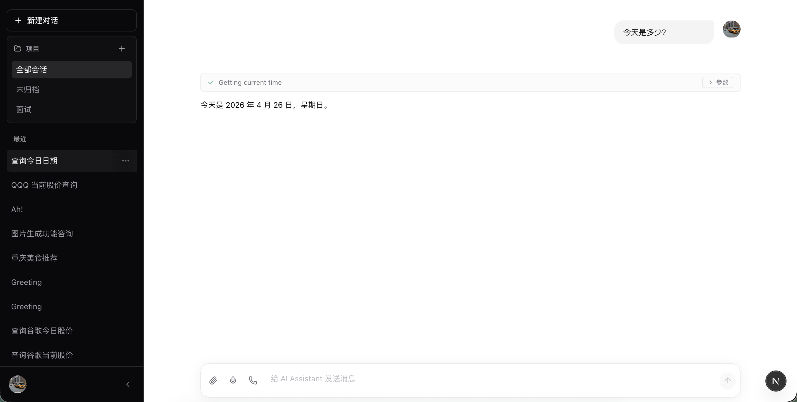

# aiguides

基于 Google ADK + Gemini 的全栈 AI 助手，支持多模态聊天、图片/视频生成、网页搜索、邮件查询、**跨会话记忆**、语音通话等功能。

## 主要功能

- 多模态对话（文字 + 图片输入）
- AI 图片生成（Imagen）
- AI 视频生成（Veo 3.1）
- 实时语音通话（Gemini Live API）
- 网页搜索与内容抓取
- 邮件查询与发送（IMAP）
- SSH 命令执行
- PDF 提取与生成
- 定时任务（支持每天/每周/一次性任务创建）
- **跨会话记忆**：AI 能记住用户特征、偏好和上下文
- 会话管理与项目组织
- Google OAuth 登录

## 聊天页面展示



## 快速启动

1. **安装依赖**
   - Go 1.26.1+
   - Node.js 20+
   - pnpm（`npm install -g pnpm`）

2. **准备配置**
   ```bash
   cp cmd/aiguide/aiguide.yaml.example cmd/aiguide/aiguide.yaml
   ```
   编辑 `cmd/aiguide/aiguide.yaml`，填写 Gemini API Key，并配置 Redis 与限流：
   ```yaml
    api_key: "your_gemini_api_key_here"
    model_name: gemini-2.0-flash-exp
    redis:
      addr: "localhost:6379"
      password: ""
    rate_limit:
      rate: 60
      period_seconds: 60
    ```
    如需 Google OAuth、网页搜索或 Exa 搜索，请参考 `cmd/aiguide/aiguide.yaml.example` 中的说明。

3. **启动服务**
   ```bash
   ./scripts/start.sh
   ```
   访问 http://localhost:3000

## 技术栈

- **后端**: Go 1.26.1+, Gin, GORM, SQLite, Google ADK
- **前端**: Next.js 16, React 19, TypeScript, Tailwind CSS
- **AI**: Google Gemini 2.0 + Imagen + Veo 3.1

## 手动启动

后端：
```bash
go run cmd/aiguide/aiguide.go -f cmd/aiguide/aiguide.yaml
```

前端：
```bash
cd frontend && pnpm install && pnpm dev
```

## Docker 部署

```bash
make build   # 构建镜像
make deploy  # 启动服务
```

## 记忆功能 (Memory Feature)

AI 助手支持跨会话记忆功能，可以记住用户的：
- **事实**（Facts）：职业、技能、背景等客观信息
- **偏好**（Preferences）：喜好、习惯、风格倾向等
- **上下文**（Context）：正在进行的项目、话题、目标等

### 使用示例

1. **告诉 AI 关于你的信息**
   ```
   用户：我是一名软件工程师，主要使用 Go 语言开发微服务。
   AI：好的，我记住了。你是一名 Go 开发者，专注于微服务架构。
   ```

2. **在新会话中，AI 会记得你**
   ```
   用户：（新会话）我想学习一些新技术，有什么建议吗？
   AI：考虑到你是 Go 微服务开发者，我建议你学习...
   ```

详细文档请查看 [Memory Feature Documentation](docs/MEMORY_FEATURE.md)

## 许可证

MIT License
